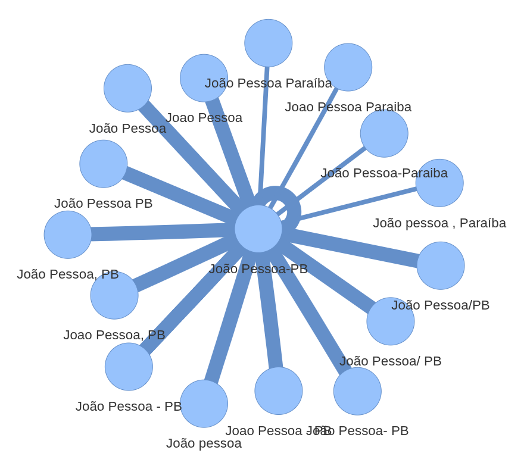

[](https://pepy.tech/project/string-treatment) [](https://badge.fury.io/py/string-treatment) [](https://opensource.org/licenses/MIT)

**string_treatment** is a library for cleaning and adjusting words with inconsistency.

# Overview

This library uses string similarity from [rapidfuzz](https://github.com/rapidfuzz/RapidFuzz) to group words with similar spelling into clusters, mapping each word to the most frequent (canonical) form within its cluster.

Since the clustering process may not always be perfectly accurate, the library can generate an interactive graph to help visualize the groupings.



# Installation

Install the latest stable version from PyPI:

```shell
pip install string-treatment
```

# Example

See the testing script in the root: [test_standardize.py](./test_standardize.py).
